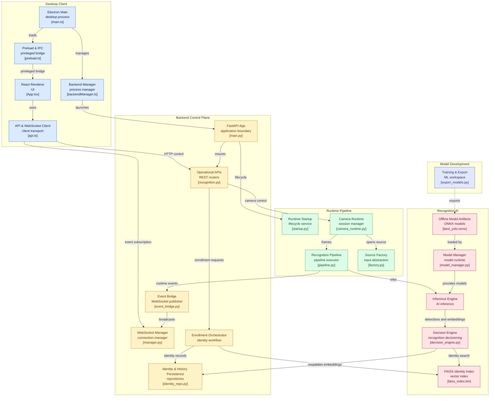

```mermaid
flowchart TD

subgraph group_desktop["Desktop Client"]
  node_electron_main["Electron Main<br>desktop process<br>[main.ts]"]
  node_backend_manager["Backend Manager<br>process manager<br>[backendManager.ts]"]
  node_preload_ipc["Preload & IPC<br>privileged bridge<br>[preload.ts]"]
  node_renderer["React Renderer<br>UI<br>[App.tsx]"]
  node_client_transport["API & WebSocket Client<br>client transport<br>[api.ts]"]
end

subgraph group_api["Backend Control Plane"]
  node_fastapi_app["FastAPI App<br>application boundary<br>[main.py]"]
  node_api_routers["Operational APIs<br>REST routers<br>[recognition.py]"]
  node_event_bridge["Event Bridge<br>WebSocket publisher<br>[event_bridge.py]"]
  node_ws_manager["WebSocket Manager<br>connection manager<br>[manager.py]"]
  node_enrollment["Enrollment Orchestrator<br>identity workflow"]
  node_persistence["Identity & History Persistence<br>repositories<br>[identity_repo.py]"]
end

subgraph group_runtime["Runtime Pipeline"]
  node_runtime_startup["Runtime Startup<br>lifecycle service<br>[startup.py]"]
  node_camera_runtime["Camera Runtime<br>session manager<br>[camera_runtime.py]"]
  node_pipeline["Recognition Pipeline<br>pipeline executor<br>[pipeline.py]"]
  node_source_factory["Source Factory<br>input abstraction<br>[factory.py]"]
end

subgraph group_ai["Recognition AI"]
  node_inference_engine["Inference Engine<br>AI inference"]
  node_model_manager["Model Manager<br>model runtime<br>[model_manager.py]"]
  node_decision_engine["Decision Engine<br>recognition decisioning<br>[decision_engine.py]"]
  node_faiss_index["FAISS Identity Index<br>vector index<br>[faiss_index.bin]"]
  node_model_artifacts["Offline Model Artifacts<br>ONNX models<br>[best_yolo.onnx]"]
end

subgraph group_ml["Model Development"]
  node_ml_training["Training & Export<br>ML workspace<br>[export_models.py]"]
end

node_electron_main -->|"manages"| node_backend_manager
node_electron_main -->|"loads"| node_preload_ipc
node_preload_ipc -->|"privileged bridge"| node_renderer
node_renderer -->|"uses"| node_client_transport
node_backend_manager -->|"launches"| node_fastapi_app
node_client_transport -->|"HTTP control"| node_api_routers
node_client_transport -->|"event subscription"| node_ws_manager
node_fastapi_app -->|"mounts"| node_api_routers
node_fastapi_app -->|"lifecycle"| node_runtime_startup
node_api_routers -->|"camera control"| node_camera_runtime
node_api_routers -->|"enrollment requests"| node_enrollment
node_camera_runtime -->|"opens source"| node_source_factory
node_camera_runtime -->|"frames"| node_pipeline
node_pipeline -->|"infer"| node_inference_engine
node_model_manager -->|"provides models"| node_inference_engine
node_model_artifacts -->|"loaded by"| node_model_manager
node_inference_engine -->|"detections and embeddings"| node_decision_engine
node_decision_engine -->|"identity search"| node_faiss_index
node_decision_engine -->|"recognition history"| node_persistence
node_enrollment -->|"identity records"| node_persistence
node_enrollment -->|"updates embeddings"| node_faiss_index
node_pipeline -->|"runtime events"| node_event_bridge
node_event_bridge -->|"broadcasts"| node_ws_manager
node_ml_training -.->|"exports"| node_model_artifacts

classDef toneBlue fill:#dbeafe,stroke:#2563eb,color:#172554
classDef toneAmber fill:#fef3c7,stroke:#d97706,color:#78350f
classDef toneMint fill:#dcfce7,stroke:#16a34a,color:#14532d
classDef toneRose fill:#ffe4e6,stroke:#e11d48,color:#881337
classDef toneIndigo fill:#e0e7ff,stroke:#4f46e5,color:#312e81

class node_electron_main,node_backend_manager,node_preload_ipc,node_renderer,node_client_transport toneBlue
class node_fastapi_app,node_api_routers,node_event_bridge,node_ws_manager,node_enrollment,node_persistence toneAmber
class node_runtime_startup,node_camera_runtime,node_pipeline,node_source_factory toneMint
class node_inference_engine,node_model_manager,node_decision_engine,node_faiss_index,node_model_artifacts toneRose
class node_ml_training toneIndigo
```
